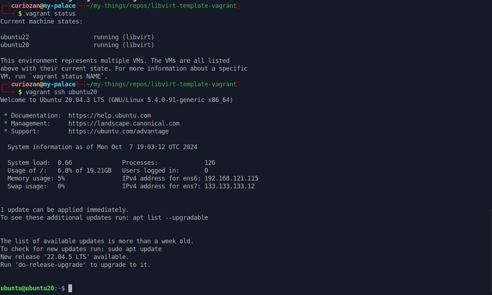

# Libvirt Vagrant Template

`Libvirt Vagrant Template` is python script to generate `Vagrantfile` that using `libvirt` provider to provision virtual machines using defined specs in `vagrant-specs.yaml` file

## Tested running environment

1. Operating system: `Ubuntu 20.04.6 LTS`
2. Qemu-kvm version: `4.2-3ubuntu6.27`
3. Libvirtd version: `6.0.0`
4. Vagrant version: `2.4.0-1`
5. Libvirt plugins version: `0.12.2`

## Features

Basically purpose of the script is to generate ready to use `Vagrantfile` to provision single or multiple virtual machines with defined specs, like:
- Define hostname, username and password
- Define network name and ip address
- Define cpu and memory
- Define multiple disk with different size
- Define os image (vagrant box)

## Installation

1. Install qemu, kvm, and libvirt. You can follow any tutorial in google

2. Install Vagrant, follow official [install vagrant](https://developer.hashicorp.com/vagrant/downloads) steps

3. Install vagrant libvirt plugin

```
vagrant plugin install vagrant-libvirt
```

4. Install genisoimage for generate cloud-init.iso

```
sudo apt install genisoimage
```

## Pre-requisite

Before using vagrant, we need to prepare ubuntu `box` first. Usually, you can find the cloud images in [official repo](https://cloud-images.ubuntu.com/). Download whatever version you want to use, then use `create_box.sh` script to create and add `box` to vagrant.

1. Create compressed box file
```
chmod +x create_box.sh
./create_box.sh <image file> <output filename>
```

2. Add box file to vagrant
```
vagrant box add <output filename> --name <box name>
```

3. Check vagrant box

```
vagrant box list
```

## Usage

1. Fill the `vagrant-specs.yaml` file with considered virtual machines specs you want to provision. 

The file structure basically like this:

```
vagrant_specs:
  vm_specs:                     -> vm lists
  - hostname:                   -> vm hostname
    network:                    -> vm network
    box:                        -> vm vagrant box name (image/os)
    username:                   -> vm username
    password:                   -> vm password
    vcpu:                       -> vm cpu core
    memory:                     -> vm memory in MB
    disks:                      -> vm list disks
    - {<device>: <size>}        -> vm disk
    ip:                         -> vm private network ip address
    pub_key:                    -> (optional) vm pub key for ssh, default using ~/.ssh/id_rsa.pub
```

2. Generate `Vagrantfile` and `cloud-init` iso file

```
python3 generate.py
```

3. Provision the virtual machines

```
vagrant up
```

4. Check vagrant virtual machines status

```
vagrant status
```

5. Ssh to virtual machines

```
vagrant ssh <virtual machine name>
```

6. If wanna make changes, first destroy current virtual machines. Make changes in `vagrant-specs.yaml` file, re-generate `Vagrantfile` then, provision the new virtual-machines

```
vagrant destroy

edit vagrant-specs.yaml

python3 generate.py

vagrant up
```

## Result 

